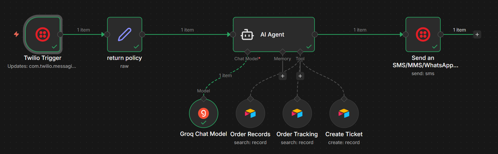

# n8n Workflow based Whatsapp Chat Integrated Bot

Project is made using n8n Workflow. Facilitating Tech team to interact with the database with the use of Whatsapp.

Stepwise Explanation:

1) Twilio Tigger for getting the message from Whatsapp.
2) Passing the message recieved from twilio to return policy.
3) Sending both the message from the sender + return policy to AI Agent
4) AI Agent will send this to Groq Chat Model to decide which Airtable is needed to be triggered for the given task.
 - If some data related to Inventory is needed then Order Records table will be triggered.
 - If Order status is needed then Order Tracking table will get triggered.
 - If New Ticket or Statement is needed to be created then Create Ticket Table will get triggered.
5) After recieveing data from Tables. It again goes to Groq Chat Model and converted to user friendly output that furtur passes to second twilio trigger
6) Second Trigger will send the incoming message to the user.

